<div align="center">

# Dr Mahreen Kiran  
## Healthcare Data Scientist and Analyst Portfolio

### Turning complex health data into clear, reproducible and clinically meaningful evidence

[](#4-methodology)
[](#featured-project-results)
[](#technical-toolkit)
[](#contact)

[**View the interactive portfolio**](index.html) &nbsp; | &nbsp;
[**Download the PDF portfolio**](Mahreen_Kiran_Healthcare_Data_Portfolio.pdf) &nbsp; | &nbsp;
[**LinkedIn**](https://linkedin.com/in/mahreen-kiran) &nbsp; | &nbsp;
[**Email**](mailto:mehreen.kiran89@gmail.com)

</div>

---

## Portfolio at a glance

| Population scale | Predictive performance | Infectious disease records | Research outputs |
|:---:|:---:|:---:|:---:|
| **500,000+** | **0.90 C-index** | **3,000 patients** | **15+ papers** |
| UK Biobank population resource | Time-to-event diabetes prediction | Six-year dengue study | Plus a book chapter |

---

# 1. Title

## **Healthcare Data and AI Portfolio**

This portfolio presents my work across population health analytics, clinical prediction, infectious disease modelling, survival analysis, causal inference, explainable artificial intelligence and Digital Twin simulation.

My focus is not only on building accurate models. I design analytical workflows that are:

* reproducible and transparent  
* statistically defensible  
* interpretable for clinical and non-technical audiences  
* aligned with real healthcare and public health decisions  
* honest about uncertainty, bias and limitations  

> **Professional value proposition:** I transform complex health datasets into evidence that helps teams understand risk, prioritise interventions and make better decisions.

---

# 2. Executive Summary

I am a PhD-trained healthcare data scientist with more than four years of experience working with large, longitudinal and multidisciplinary datasets. My research has used UK Biobank data, clinical and epidemiological records, environmental data, medical imaging and behavioural variables.

I work across the complete analytical lifecycle, from cohort definition and data quality assessment to modelling, validation, explainability and communication. My strongest areas include survival analysis, machine learning, causal inference, neural networks, SHAP explainability and healthcare-focused data storytelling.

### What makes this portfolio different

| Capability | Evidence demonstrated in this portfolio |
|---|---|
| **Population health analytics** | Diabetes risk research using the UK Biobank population resource |
| **Longitudinal modelling** | Cox survival models and time-to-event risk trajectories |
| **Clinical interpretation** | Translation of psychosocial, behavioural and lifestyle predictors into actionable insight |
| **Model validation** | Cross-validation, calibration, robustness checks and sensitivity analysis |
| **Responsible AI** | SHAP, causal reasoning, ablation analysis and clear reporting of limitations |
| **Public health analytics** | Multi-year dengue prediction across five endemic districts |
| **Multidisciplinary collaboration** | Work spanning healthcare, epidemiology, computer science, agriculture and sustainability |

### Core impact

My diabetes research achieved a **C-index of 0.90**, demonstrating strong discrimination for time-to-event risk prediction. The work also showed that behavioural and psychosocial factors, including sleep, loneliness and mental health history, contain meaningful information for diabetes prevention.

My dengue research analysed **3,000 patient records**, **52 variables**, **six years of data** and **five endemic districts**. Four supervised models achieved AUC-ROC values between **0.904 and 0.939**, with Logistic Regression producing the highest reported AUC-ROC of **0.939**.

---

# 3. Business Problem

Healthcare organisations often have large volumes of data but still struggle to convert that data into reliable, usable evidence.

The central problem is not simply predicting an outcome. The real challenge is to answer five questions:

1. **Can the data be trusted?**  
   Clinical, behavioural and administrative datasets often contain missing values, inconsistent coding, duplicated records and complex inclusion criteria.

2. **Does the model answer the correct healthcare question?**  
   A classification model may predict whether an event occurs, but healthcare teams may need to know when it is likely to occur and how risk changes over time.

3. **Can the result be explained?**  
   High performance alone is insufficient when clinicians, analysts and decision-makers cannot understand what drives the prediction.

4. **Will the model generalise?**  
   A model can appear successful because of diagnostic leakage, class imbalance or variables that would not be available at the time of decision-making.

5. **Can the analysis support action?**  
   Results must be translated into clear recommendations for prevention, service planning, surveillance or resource allocation.

### My analytical response

I address these challenges by combining rigorous data preparation, appropriate statistical design, transparent validation and decision-focused communication.

| Healthcare challenge | Analytical response |
|---|---|
| Fragmented and heterogeneous data | Cohort design, harmonisation, recoding and data quality profiling |
| Time-dependent outcomes | Survival analysis and risk trajectory modelling |
| Complex non-linear relationships | Ensemble learning and neural networks |
| Limited model trust | SHAP, feature importance and clinically meaningful interpretation |
| Confounding and causal questions | Directed acyclic graphs, matching and adjusted modelling |
| Risk of misleading performance | Cross-validation, temporal checks, ablation and sensitivity analysis |
| Weak translation into practice | Visual reporting, dashboards and stakeholder-focused summaries |

---

# 4. Methodology

My methodology follows a structured, traceable and healthcare-focused workflow.

```mermaid
flowchart LR
    A[Clinical or population question] --> B[Data governance and cohort definition]
    B --> C[Data quality assessment]
    C --> D[Exploratory analysis]
    D --> E[Feature engineering]
    E --> F[Statistical and machine learning models]
    F --> G[Validation and calibration]
    G --> H[Explainability and sensitivity analysis]
    H --> I[Clinical or public health interpretation]
    I --> J[Decision-ready reporting]
```



### Step 1: Define the decision problem

I begin by clarifying the outcome, population, prediction time point and intended use. This prevents technically strong models from answering the wrong question.

### Step 2: Build the analytical cohort

I define inclusion and exclusion criteria, map variables to phenotype definitions and create traceable analytical datasets.

### Step 3: Assess and prepare the data

Typical activities include:

* missing-data profiling  
* inconsistent coding checks  
* categorical and binary recoding  
* outlier assessment  
* class balance review  
* temporal and geographic consistency checks  
* feature scaling and transformation  

### Step 4: Explore the data

I use descriptive statistics and visualisation to identify distributions, trends, subgroup differences, correlations and potential sources of bias.

### Step 5: Select the appropriate model

The model is chosen according to the decision problem:

| Question | Example approach |
|---|---|
| Which patients are at higher risk? | Logistic Regression, Random Forest, Gradient Boosting |
| When may an event occur? | Cox proportional hazards and survival analysis |
| Which factors drive the result? | SHAP, feature importance and coefficient interpretation |
| What may happen under an intervention? | Causal inference and Digital Twin simulation |
| How do behaviours interact as a system? | Neural networks and behavioural network analysis |

### Step 6: Validate responsibly

I use cross-validation, calibration, robustness checks, temporal or geographic validation, sensitivity analysis and ablation analysis where appropriate.

### Step 7: Translate findings into decisions

The final output is designed for the intended audience. This may include a technical report, visual dashboard, risk summary, stakeholder presentation or publication-ready evidence.

---

# Featured Project Results

## 1. Behaviour-Aware Digital Twin for Type 2 Diabetes Prediction


### Objective

Develop an interpretable framework for predicting the onset of Type 2 Diabetes Mellitus using lifestyle, psychosocial and behavioural information.

### Approach

* UK Biobank population-scale health data  
* Cox proportional hazards modelling  
* cross-validation and proportional hazards testing  
* risk stratification and Kaplan-Meier analysis  
* causal inference and intervention simulation  
* neural network analysis of behavioural interactions  
* explainability and clinically focused reporting  

### Key result

The survival model achieved a **C-index of 0.90**. Sleep, loneliness, mental health history, diet, smoking and age contributed meaningful risk information. The Digital Twin framework enabled what-if simulations for preventive intervention scenarios.

### Why it matters

This project moves beyond biomarker-only prediction and demonstrates how behavioural and psychosocial information can support earlier, more personalised diabetes prevention.

---

## 2. Machine Learning Prediction of Dengue Infection


### Objective

Evaluate whether clinical, serological, epidemiological and environmental variables can support reliable dengue prediction across multiple years and locations.

### Dataset

* **3,000 patient records**  
* **52 features**  
* **2019 to 2024**  
* **five endemic districts**  
* clinical, haematological, serological, environmental and epidemiological variables  

### Models

* Logistic Regression  
* Random Forest  
* Gradient Boosting  
* Decision Tree  

### Key result

The models achieved AUC-ROC values between **0.904 and 0.939**. Logistic Regression achieved the highest AUC-ROC of **0.939**, while the Decision Tree produced the highest reported raw accuracy of **88.8%**.

### Responsible interpretation

The analysis distinguishes individual-level diagnostic prediction from population-level environmental surveillance. This is important because strong predictive performance can be driven by serological markers that are already close to the diagnostic outcome.

---

## 3. Explainable AI for Climate-Dependent Treatment Effectiveness


### Objective

Understand how temperature, humidity and precipitation interact with treatment effectiveness using machine learning and explainable AI.

### Approach

* XGBoost modelling  
* SHAP interaction analysis  
* 1,000 Monte Carlo simulations  
* climate and treatment interaction analysis  
* molecular modelling and docking evidence  

### Key result

The analysis identified climate-dependent, region-specific and adaptable treatment patterns. It demonstrated my ability to integrate experimental, environmental and computational evidence within one interpretable workflow.

### Transferable healthcare value

The same methods are relevant to treatment response analysis, environmental health, personalised intervention modelling and complex feature interaction assessment.

---

# Technical Toolkit

| Area | Tools and methods |
|---|---|
| **Programming** | Python, SQL, R |
| **Data analysis** | pandas, NumPy, Excel, Jupyter Notebook |
| **Machine learning** | scikit-learn, XGBoost, TensorFlow, PyTorch |
| **Survival analysis** | lifelines, scikit-survival, Cox regression |
| **Explainability** | SHAP, feature importance, partial interpretation |
| **Causal methods** | Directed acyclic graphs, matching, adjusted regression, refutation tests |
| **Visualisation** | Matplotlib, Seaborn, Power BI |
| **Research analytics** | VOSviewer, bibliometric analysis, literature mapping |
| **Validation** | Cross-validation, calibration, sensitivity analysis, ablation and robustness checks |

---

# Responsible Healthcare Analytics

I treat model performance as one part of a wider evidence framework.

My work places particular emphasis on:

* avoiding data leakage  
* separating prediction from diagnosis  
* reporting limitations clearly  
* checking subgroup and population differences  
* preserving reproducibility and traceability  
* communicating uncertainty  
* ensuring outputs support, rather than replace, professional judgement  

> **A trustworthy model is not only accurate. It is appropriately designed, transparently validated and clearly interpreted.**

---

# Repository Structure

```text
Mahreen_Kiran_Healthcare_Portfolio_GitHub/
│
├── README.md
├── index.html
├── Mahreen_Kiran_Healthcare_Data_Portfolio.pdf
├── .nojekyll
└── assets/
    ├── diabetes_survival.png
    ├── diabetes_clustering.png
    ├── behaviour_networks.png
    ├── dengue_auc.png
    ├── bibliometric_trends.png
    ├── xai_workflow.png
    ├── molecular_docking.png
    └── shap_interactions.png
```

---

# How to View the Portfolio

### Option 1: GitHub

Open `README.md` to review the project summary, methods and results.

### Option 2: Interactive website

Open `index.html` in a browser.

### Option 3: GitHub Pages

In the repository settings:

1. Open **Pages**
2. Select **Deploy from a branch**
3. Choose the `main` branch
4. Select the root folder
5. Save

GitHub will publish the portfolio as a live website.

### Option 4: PDF

Open `Mahreen_Kiran_Healthcare_Data_Portfolio.pdf` for a recruiter-friendly document that can be attached to applications.

---

# Target Roles

* Healthcare Data Analyst  
* Senior Data Analyst  
* Clinical Data Analyst  
* Population Health Analyst  
* Health Data Scientist  
* Healthcare AI Researcher  
* Public Health Data Analyst  

---

# Contact

**Dr Mahreen Kiran**  
Portsmouth, United Kingdom  
Global Talent Visa, no sponsorship required  

Email: [mehreen.kiran89@gmail.com](mailto:mehreen.kiran89@gmail.com)  
LinkedIn: [linkedin.com/in/mahreen-kiran](https://linkedin.com/in/mahreen-kiran)

---

<div align="center">

### Data becomes valuable when it is transformed into evidence people can trust and use.

</div>
